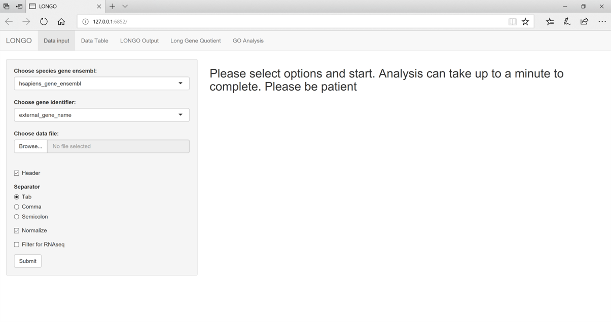
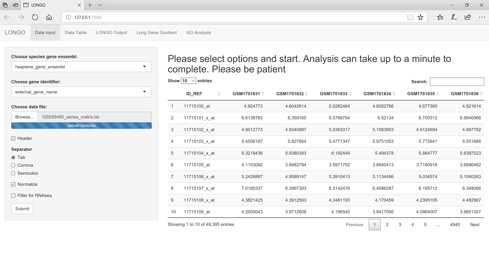
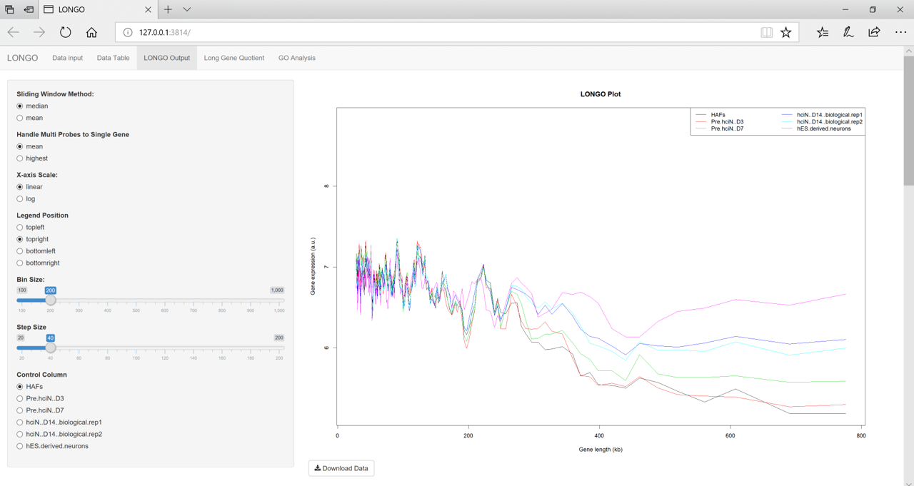
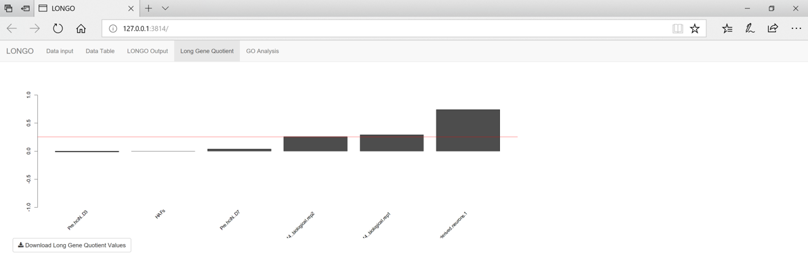
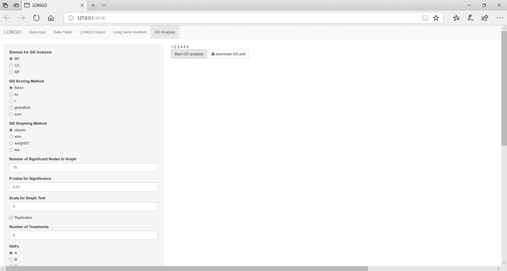

# LONGO: Gene Length-Dependent Expression Analysis Tool in Neuronal Cells
Documentation is also available on GitHub Pages: https://biohpc.github.io/LONGO/  

LONGO is designed to have two different uses. One through a shiny interface 
and another through R. Both of results of the program are 
the same. The shiny interface will allow the user to alter certain variables
in the analysis to see how they will affect the result. This can be 
useful when interpreting new data. 

LONGO is designed to take in a data file with a gene identifier to get 
the gene name and length. Occasionally there will be multiple probes going
to a single gene. LONGO can handle this in two different ways. The default way
is to get the mean expression values. The other option is to only keep the
probe that has the highest overall expression values. If a read has no
identified gene name or length in BioMart, the read is removed. 

After getting the gene names and lengths the data is sorted by length. A
rolling window is used to create bins. The user can change the size of the
window as well as the step size of the window. These rolling window values 
are then plotted. The P value plot shows the p value comparisons of the values
making up the windows to the window values in the control. 

# Pre-requisites:
* R version
    * Download R (>3.3.0) version from CRAN. 
        * Windows: https://cran.r-project.org/bin/windows/base/ 
        * Mac OS X: https://cran.r-project.org/bin/macosx/ 
        * Linux: https://cran.r-project.org/bin/linux/ 

*   biomaRt package
    *   install by using the following R commands:  

            > source("https://bioconductor.org/biocLite.R")  
            > biocLite("biomaRt")  

*   edgeR package
    *   install by using the following R commands:  

            > source("https://bioconductor.org/biocLite.R")  
            > biocLite("edgeR")  

*   preprocessCore package
    *   install by using the following R commands:  

            > source("https://bioconductor.org/biocLite.R")  
            > biocLite("preprocessCore")  
            
*   topGO package
    *   install by using the following R commands:  

            > source("https://bioconductor.org/biocLite.R")  
            > biocLite("topGO")  
            
*   Rgraphviz package
    *   install by using the following R commands:  

            > source("https://bioconductor.org/biocLite.R")  
            > biocLite("Rgraphviz")

*   shiny package:
    *   install by using the following R command:  

            > install.packages("shiny")  

*   DT package
    *   install by using the following R command:  

            > install.packages("DT")  
            
*   data.table package
    *   install by using the following R command:  

            > install.packages("data.table")  

*   hash package:
    *   install by using the following R command:  

            > install.packages("hash") 

# Installing LONGO Package:
To install the LONGO package all the prerequisites above need to be installed.
After confirming those packages are installed start RStudio. From there follow
the instructions below: 
 
*	Tools dropdown -> Install Packages… 
*	Change the Install from dropdown to Package Archive File 
*	Locate the LONGO tarball (LONGO_0.3.0.tar.gz) 
*	Click install 

Another option is to use the follow R line: 

 	> install.packages(“~/LONGO_0.3.0.tar.gz”, repos = NULL, type = “source”) 

# Pre-processing:
In order to use LONGO the data needs to be in a specific format. This format
has the gene identifier in the first column and all of the other columns are 
expression values. The first row can be a header. The script file in the LONGO-script
directory has multiple examples of pre-processing.

# Usage with LONGO():
- Launch LONGO  
    > LONGO()
    

- Load pre-processed data
    - Select options for data file
- Select species
- Select gene identifier
    - Make sure gene identifier is in the first column
- Confirm data is accurate, click submit

- Wait until the analysis completes
- Data Table output tab has the gene name, length for the data

- LONGO Output tab has the LONGO plot and few other statistical plots
    - Can adjust certain variables to see how they affect the plots
    

- Long Gene Quotient tab has the long gene quotient plot

 
- The raw data for all of these plots are available to be downloaded 
via download buttons
- The GO Analysis tab provides options allowing graphing of the GO enrichment
analysis

# Usage with LONGOcmd():
The LONGOcmd function will automatically write the output data files to your
working directory. This can allow faster data analysis if you know the values
to use. LONGOcmd can also be used with an R dataframe as the input file as long
as it satisfies the format described in the pre-processing section above.
The shiny interface is more beginner friendly while the LONGOcmd()
requires more specific knowledge at the start. The LONGOcmd() function uses
the same techniques but requires only the initial input. If you know the BioMart
species database and gene identifier, you can use this for faster analysis.
The example gives an overview of the possible input variables and their
defaults. 
*   Use the following R command:  
        > LONGOcmd(fileLocation = path_to_file, {separator = ","},
            {header = TRUE}, {commentChar = "!"},
            {species = "hsapiens_gene_ensembl"}, 
            {libraryType = "affy_primeview"}, {multiProbes = "mean"},
            {windowSize = 200}, {stepSize = 40}, {windowStyle = "mean"},
            {filterData = TRUE}, {normalizeData = TRUE}, {controlColumn = 2})
*   Output files are written to the working directory
