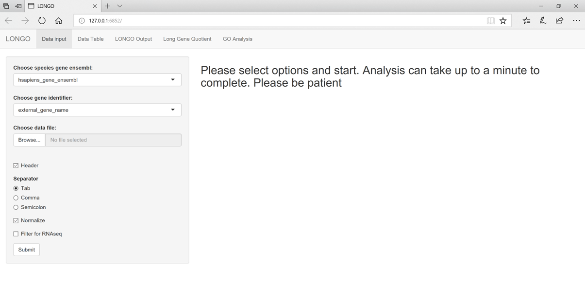
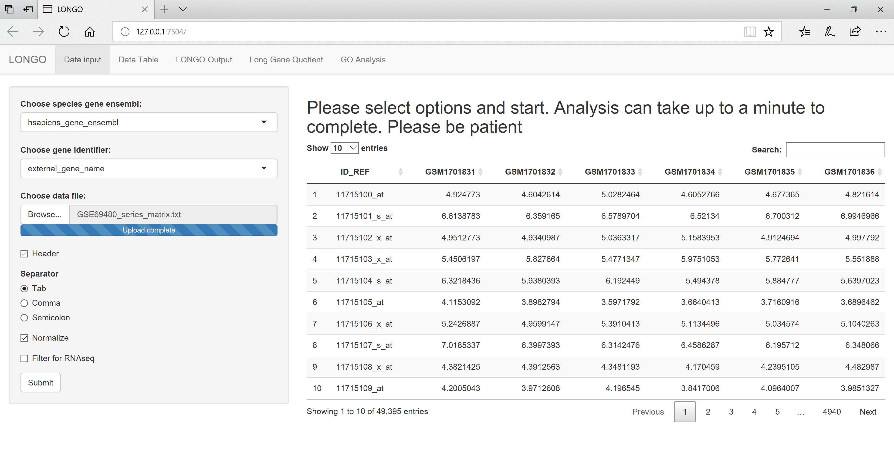
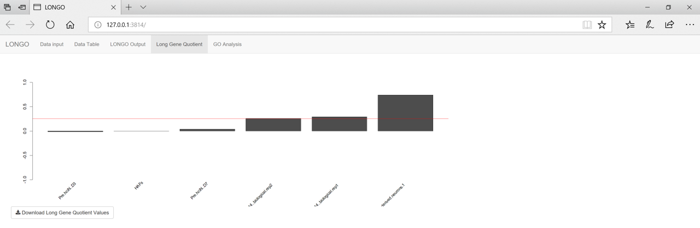
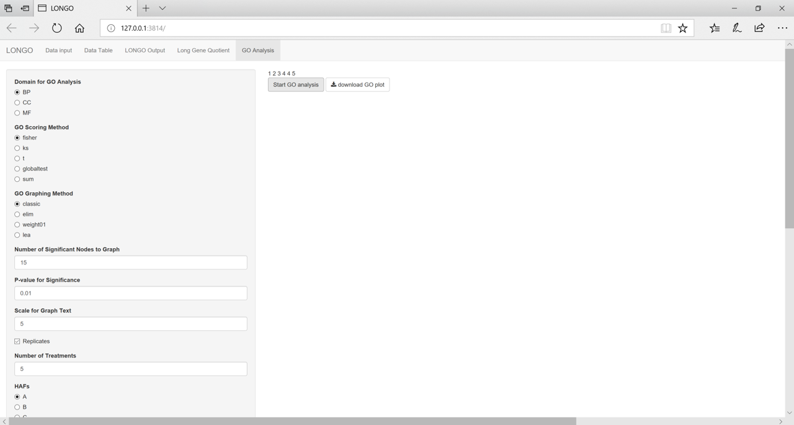

# Usage:

## Pre-processing:
In order to use LONGO the data needs to be in a specific format. This format
has the gene identifier in the first column and all of the other columns are 
expression values. The first row can be a header which will help in viewing the 
plots. An example human data set can be downloaded
[GSE69480](ftp://ftp.ncbi.nlm.nih.gov/geo/series/GSE69nnn/GSE69480/matrix).
This data is in the correct format and will be used in the example below. 
 
## LONGO():
The next step is to use the start the shiny interface of LONGO using: `LONGO()`
This will start a new window showing the main menu as seen in figure 1. 
  
 
  
  
  
  
Once you have the session started you can upload your data file. For this 
example
the dataset provided above is going to be used. The data file is for humans so
the default species gene ensembl can be used. If your data is from a different
species select it from the drop down. As you change the species the available
options for the gene identifier will also change. This is because the biomart
database has different identifiers for different species. The example data uses
the `affy_primeview` as a gene identifier. The default option fo the separator
is tab separated, which is what the example data file uses. Once all the correct
options are selected the view should look like figure 2. As the options related
to the data file are changed the updated view of the data is shown in the main
window.  
  
 
  
  
  
  
This next step can take up to a minute depending on how large the dataset is.
Once LONGO finishes there will be a notice on the top stating it completed and 
the time it finished. The Data Table tab shows the results of the gene names
and gene lengths depending on the gene identifier used. There is an option to
download this data. 
  

  
  
  
  
The LONGO Output tab shows the LONGO plot. This plot shows the results of the
window binning for each dataset. The initial results are using the default
values. 
  
 
  
  
  
  
There are several parameters on the side panel of the LONGO Output tab. All of
these options change the results. 

- Sliding Window Method
    This parameter is used to get the final bin result. The two options median
    or mean can be used. The median is the default option which takes the median
    expression of all the genes within the window.
- Handle Multi Probes to Single Gene
    This parameter is used to reduce the number of gene identifiers which are
    for the same gene. There are two options the mean or the highest. 
- X-axis scale
    This parameter is used as the axis for the plots. 
- Legend Position
    This parameter changes the position of the legend. 
- Bin Size
    This parameter is used change the size of the bin. The default is 200.
    Dencreasing the bin size, increases the chances of a bin not having any
    genes. This will mess up the plot. 
- Step Size
    This parameter is used to change the step size LONGO takes.
- Control Column
    This parameter is used if the data has a control column in your data.
    This option is used for calculating the LONG Gene Quotient. 
 
The Long Gene Quotient tab shows the bar graph with the results of the Long
Gene Quotient analysis. The red bar is used to mark the 0.25 point. Generally
any LQ value above 0.25 means the sample is neuronal. 
  
 
  
  
  
  
The GO Analysis tab allows creation of a GO enrichment graph using the topGO
package. There are multiple input variables that can be altered to get different
graphs.
- Domain for GO Analysis
    This parameter is used to determine which Gene Ontology Domain should be
    used: Cellular Component, Molecular Functions, Biological Processes.
- GO Scoring Method
- GO Graphing Method
- Number of Significant Node to Graph
- P-value for significance 
- Scale for Graph Text
- Replicates 
- Number of Treatments
    This is used to determine how many options will be displayed for the samples
 
  
 
  
  
  
  
## LONGOcmd():
The LONGOcmd function will automatically write the output data files to your
working directory. This can allow faster data analysis if you know the values
to use. LONGOcmd can also be used with an R dataframe as the input file as long
as it satisfies the format described in the pre-processing section above.
The shiny interface is more beginner friendly while the LONGOcmd()
requires more specific knowledge at the start. The LONGOcmd() function uses
the same techniques but requires only the initial input. If you know the BioMart
species database and gene identifier, you can use this for faster analysis.
The first example gives an overview of the possible input variables and their
defaults. The other examples use a data file that is included in the LONGO
package. 
```{}
    LONGOcmd(fileLocation = path_to_file, {separator = ","},
        {header = TRUE}, {commentChar = "!"},
        {species = "hsapiens_gene_ensembl"}, 
        {libraryType = "affy_primeview"}, {multiProbes = "mean"},
        {windowSize = 200}, {stepSize = 40}, {windowStyle = "mean"},
        {filterData = TRUE}, {normalizeData = TRUE}, {controlColumn = 2})
            
    LONGOcmd(exampleRatData, SPECIES = "mmusculus_gene_ensembl",
        LIBRARY_TYPE = "external_gene_name")
    
    LONGOcmd(exampleRatData, SPECIES = "mmusculus_gene_ensembl",
        LIBRARY_TYPE = "external_gene_name", WINDOW_SIZE = 350, 
        MULTI_PROBES = "highest", FILTERED = FALSE)
```


## Biomart identifier options (as of `r Sys.Date()`)
Below is a list of all the Biomart data sets available. 
```{r, echo=FALSE}
    biomaRt::listDatasets(biomaRt::useMart("ENSEMBL_MART_ENSEMBL", 
        host = "www.ensembl.org"))[1]
```

Once the data set is selected from above it is possible to get a list of
possible
gene identifies using the following command, where 'speciesDataset' is
a data set from the above list.
```{}
    ensembl <- biomaRt::useMart("ENSEMBL_MART_ENSEMBL", 
        host = "www.ensembl.org", dataset=<speciesDataset>)
```

For the LONGO analysis, the "external_gene_name" from the BioMart data set
was used as the source of the gene name. This was used to determine if there
were duplicate reads. The method for handling these repeats is based on the
input variable of "MULTI_PROBES"
